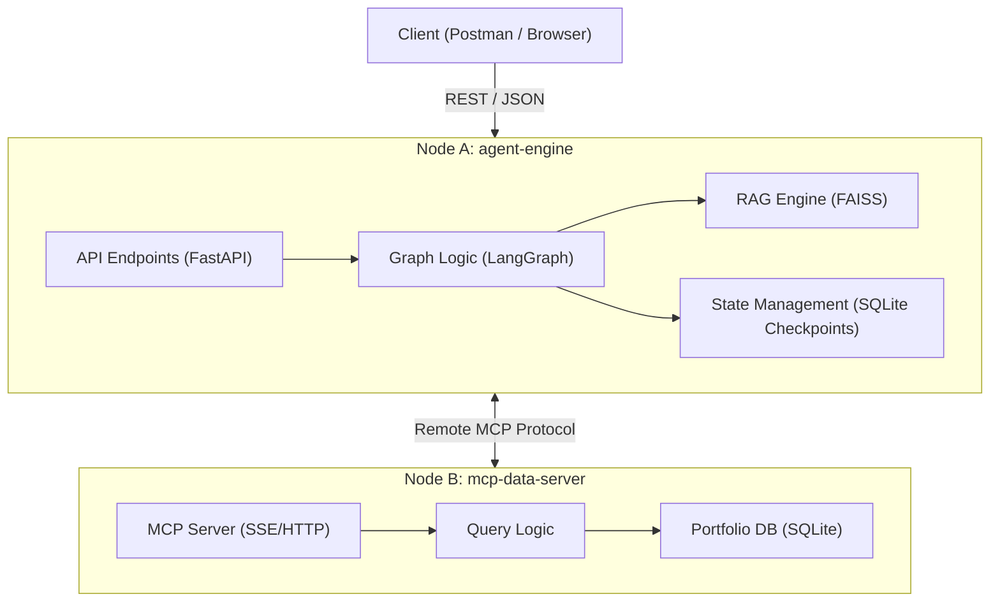
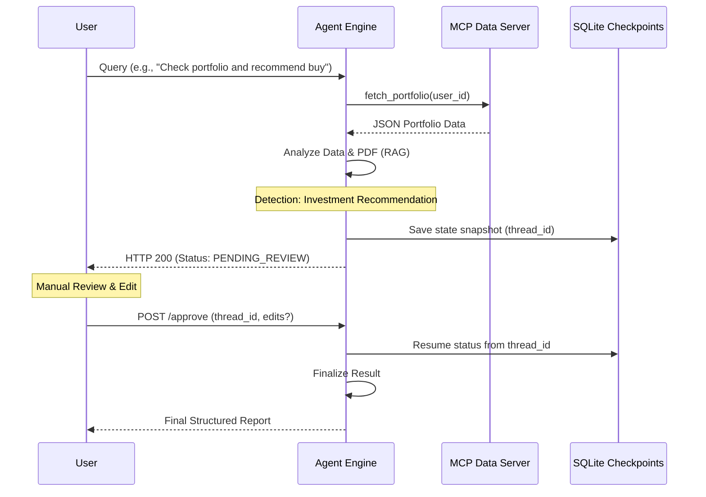

# FINA: Financial Intelligence Network Architect

FINA is a state-of-the-art **Global Macro-Investment Analyst** system powered by a multi-agent AI architecture. It bridges the gap between fragmented financial data sources—including private portfolios, real-time market news, and dense corporate reports—to provide high-fidelity investment insights.

Designed for professional financial analysis, FINA implements a three-layer research protocol before issuing recommendations, maintaining a strict **Human-In-The-Loop (HITL)** governance model.

---

## 🏛️ System Architecture

FINA is designed as a **Distributed Dual-Node Architecture** to optimize resource usage and ensure strict data isolation.

### Component Diagram


### Node Breakdown
1.  **Node A: Agent Engine (The Brain)**: 
    - Unifies the reasoning core (LangGraph) and the document retrieval engine (RAG). 
    - **Vector Storage**: Uses **FAISS** for efficient semantic search over financial PDFs.
2.  **Node B: MCP Data Server (The Data Vault)**: 
    - Isolated container managing sensitive user portfolios. 
    - Communicates exclusively via the **Model Context Protocol (MCP)** over SSE/HTTP, simulating a remote corporate environment.

---

## 🏗️ Software Design (fina-agent-engine)

The system is built following professional software engineering principles to ensure maintainability and scalability:

-   **Layered Architecture**: Clear separation of concerns between `API` (FastAPI), `Core` (Config/Settings), `Service` (Business Logic), and `Tools` (external integrations).
-   **State Machine (Graph-Based Flow)**: Orchestration is managed by **LangGraph**, treating the workflow as a state machine where nodes represent atomic actions (Thinking, Searching, Reviewing) and edges define conditional transitions.
-   **Adapter Pattern**: Tools are implemented as adapters, normalizing various data sources (FAISS, MCP) into a standard format the LLM can process.
-   **Asynchronous Execution**: Fully async workflow to support concurrent users and real-time streaming.

---

## ⚖️ Governance & HITL Flow

One of FINA's most critical features is its **Human-In-The-Loop (HITL)** protocol. When the agent detects a high-impact financial recommendation, the execution is automatically paused for human verification.

### HITL Sequence Diagram


---

## 🚀 Key AI Engineer Concepts Implemented

-   **Persistence (Checkpoints)**: Uses `langgraph-checkpoint-sqlite` to allow long-running reasoning tasks to survive restarts and wait for asynchronous human approval.
-   **Self-Healing**: Implements recursive error-correction loops. If an LLM generates invalid tool parameters, the system catches the **Pydantic validation error** and re-injects it into the prompt for the agent to self-correct.
-   **Observability**: Detailed structured logging and real-time token tracking to monitor performance and operational costs ($USD) per session.
-   **Input/Output Guardrails**: Multi-stage checking to prevent jailbreaking (Input) and ensure all outgoing advice includes mandatory financial disclaimers (Output).

---

## 🛠️ Getting Started

### Systems Requirements
- **Python**: v3.12.8
- **Environment**: Docker Desktop (Windows/Linux/Mac)
- **API Access**: Access to Groq and HuggingFace Hub.

### Configuration (`.env`)
Create a `.env` file in the `fina-orchestrator/` directory:

| Variable | Description | Source |
| :--- | :--- | :--- |
| `GROQ_API_KEY` | Key for Llama-3.x models | [Groq Cloud](https://console.groq.com/) |
| `HUGGINGFACEHUB_API_TOKEN` | Key for Embedding models | [HuggingFace](https://huggingface.co/) |

### Execution
Launch the entire ecosystem from the `fina-orchestrator/` folder:
```powershell
docker-compose up --build
```

### Accessing the API
👉 **[http://localhost:8000/docs](http://localhost:8000/docs)** (Swagger UI)

---

## 🧪 Quick Start Testing Guide

To test the system's full flow (Portfolio query → Investment Recommendation → Human Approval), use the following credentials:

### 👤 Dummy User Data
The local database comes pre-seeded with data for a test user. Use this ID when querying portfolios via the agent or directly through the MCP server tools.
- **Test User ID**: `user123`
- **Pre-loaded Assets**: `AAPL` (10 shares), `NVDA` (5 shares).

### 👮 Supervisor Authorization (HITL)
When the system pauses for **Human-In-The-Loop** review (Status: `PENDING_REVIEW`), use one of these valid supervisor codes to authorize the completion of the action:

| Supervisor Code | Role | Area |
| :--- | :--- | :--- |
| `SUP-9988` | Senior Portfolio Manager | Area A |
| `SUP-1122` | Compliance Officer | Area B |

---

## 🧪 Development & Testing

### Unit Testing
Run tests locally for any node:
```powershell
$env:PYTHONPATH="."; pytest
```

### AI Evaluation (Evals)
Located in `fina-agent-engine/tests/evals`. These tests use **LLM-as-a-judge** to validate the accuracy of RAG responses and the robustness of the safety guardrails against adversarial prompts.
