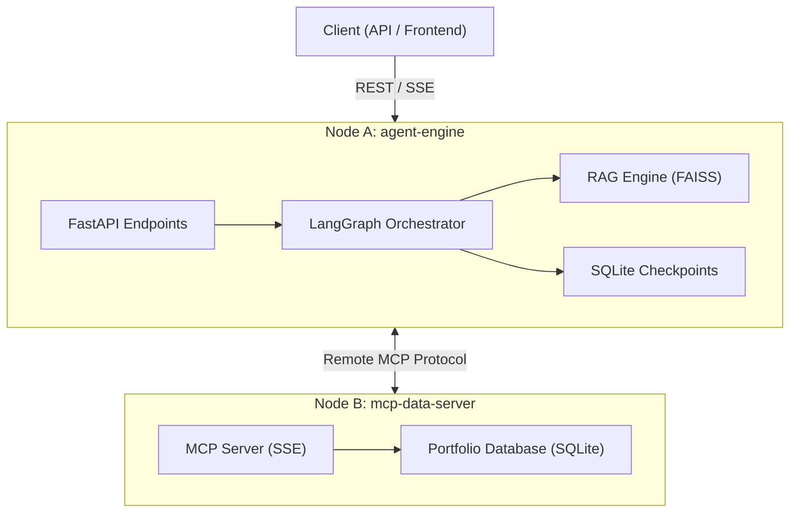

# FINA Agent Engine (Node A)

**Financial Intelligence Network Architect (FINA)** is a distributed, multi-agent orchestration engine designed for high-stakes financial analysis. It serves as **Node A** (The Orchestrator) in a secure, multi-node architecture, bridging the gap between fragmented data sources, private corporate vaults, and decision-makers.

In modern finance, data is often siloed between protected databases, dense PDF reports, and real-time market news. FINA solves this by implementing a three-layer investigation protocol that combines advanced AI reasoning with strict human governance.

## 🏗️ Architecture: Distributed Intelligence

FINA follows a **Two-Node Distributed Design** to ensure resource efficiency and data isolation:

- **Node A (Agent Engine):** The "Brain." It manages state, reasons through queries using LangGraph, and handles document ingestion (RAG).
- **Node B (MCP Data Server):** The "Vault." An independent service that exposes sensitive portfolio data via the **Model Context Protocol (MCP)** over SSE/HTTP, ensuring the AI never has direct access to the raw database.



## 🧠 Core AI Concepts & Technologies

This implementation leverages state-of-the-art patterns for autonomous agents:

### 1. Cognitive Reasoning & Orchestration
- **LangGraph State Machine:** Uses a cyclic graph to manage complex states, enabling re-planning and persistence.
- **ReAct Pattern:** Implements iterative "Reason + Act" cycles for tool use and investigation.
- **Chain of Thought (CoT):** Forces the model to decompose complex financial questions into logical execution steps.
- **Self-Healing Logic:** Detects tool call failures or schema errors and automatically reformulates queries.

### 2. Multi-Source Data Knowledge
- **Persistence (Checkpoints):** LangGraph persists the current internal state dictionary in a SQLite checkpointer (`checkpoints.sqlite` in the root). 
- **Snapshot Execution:** The system can recover threads by ID, allowing the agent to resume exactly where it left off after human approval.
- **RAG (Retrieval Augmented Generation):** High-performance PDF processing using `FAISS` and `HuggingFace` embeddings for semantic search in annual reports.
- **Remote MCP:** Securely retrieves private user data via a remote protocol, simulating enterprise-grade data isolation.
- **Advanced Tool Calling:** Pydantic-validated tool schemas with automated fallback mechanisms.

### 3. Governance & Production (LLMOps)
- **Human-In-The-Loop (HITL):** Strategic breakpoints that pause execution for human approval before finalizing high-risk recommendations.
- **Audit & Compliance:** Detailed logging and versioned state snapshots for every decision pathway.
- **Observability:** Real-time token tracking, cost estimation, and detailed logging for audit trails.
- **Streaming:** Server-Sent Events (SSE) provide real-time feedback on the agent's reasoning process.

## 🚀 Getting Started

### Prerequisites
- Python 3.12+
- Groq API Key (for high-speed reasoning)
- HuggingFace API Token (for embeddings)
- Node B (mcp-data-server) running and accessible.

### Installation

1.  **Clone the repository:**
    ```bash
    git clone <repository-url>
    cd fina-agent-engine
    ```

2.  **Install dependencies:**
    ```bash
    pip install -r requirements.txt
    ```

3.  **Configure environment:**
    Create a `.env` file in the root:
    ```env
    GROQ_API_KEY=your_key_here
    HUGGINGFACEHUB_API_TOKEN=your_token_here
    LOG_LEVEL=INFO
    ```

### Running the Engine

Start the FastAPI server:
```bash
python main.py
```
The API documentation will be available at `http://localhost:8000/docs`.

## 🛠️ Tooling & Workflows

### Primary Tools
- `get_user_portfolio`: Fetches assets and balances via Remote MCP.
- `search_financial_docs`: Semantic search within ingested PDFs (RAG).
- `market_search_tool`: (External) Fetches real-time financial news.

### Key Flows
- **Hybrid Investigation:** Combines RAG (historical data) with Web Search (latest news) for comprehensive risk analysis.
- **Portfolio Validation:** Cross-references investment intentions with real-time balance and exposure data from the MCP Server.
- **Approval Protocol:** Pauses at critical nodes, saving a snapshot of the `AgentState` until an authorized user invokes the `/approve` endpoint.

## ⚖️ Governance & Security
FINA enforces a **Segregation of Duties** (SoD). While the agent can synthesize and propose investment strategies, the actual execution or final recommendation log requires a positive signal from the human gatekeeper, ensuring safety and compliance in high-risk environments.
